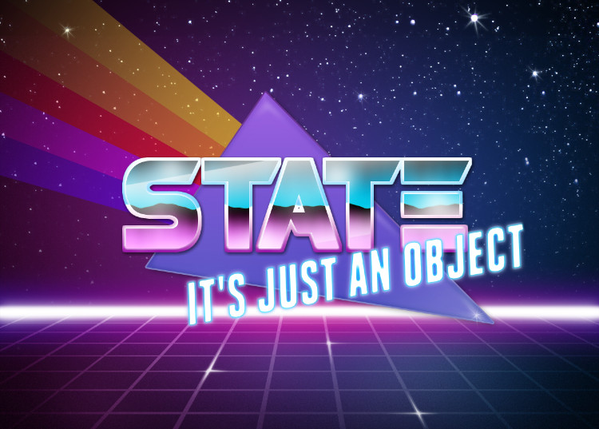

# React, State, and Lifecycle Methods

### Learning Objectives

- Explain React state
- Describe the React component lifecycle
- Explain the most important lifecycle methods
- Implement a react component that fetches some data from the web
- Discuss React events

# React State

State is an object that React watches to decide when to update the DOM.

## 🚀 Lab 1

[stuff]

# Topic 2

[stuff]

## 🚀 Lab 2

# Recap!